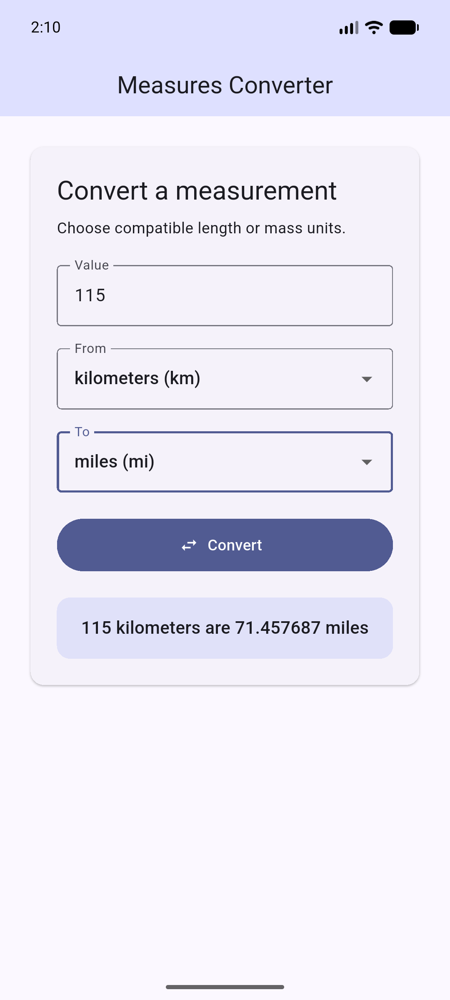

# Measures Converter

## Overview

Measures Converter is a Flutter and Dart application for converting compatible length and mass units between metric and imperial systems.

## Features

- Numeric input with clear validation
- Compatible From and To unit selection
- Same-unit and repeated conversions with formatted results

## Supported Units

- Length: meters, kilometers, feet, and miles
- Mass: kilograms, grams, pounds, and ounces

## Technologies

Flutter, Dart, Android Emulator, Git, GitHub, and Visual Studio Code.

## Project Structure

```text
lib/
  main.dart                         Application UI and interaction state
  models/conversion_unit.dart       Unit definitions and categories
  services/conversion_service.dart  Base-unit conversion logic
test/
  conversion_service_test.dart      Conversion-service unit tests
  measures_converter_widget_test.dart  UI behavior tests
android/app/src/main/AndroidManifest.xml  Android application manifest
```

## Conversion Design

Each value is converted through a category base unit: meters for length and kilograms for mass. This keeps formulas centralized in the conversion service and separate from the UI.

## Running the Application

```bash
flutter pub get
flutter run
```

## Testing

```bash
dart format .
flutter analyze
flutter test
```

## Screenshot



## Repository

<https://github.com/AshishM26/MSCS-533-A01_Assignment_1>

## Development Tools

I used Flutter, Dart, Android Studio, Visual Studio Code, Git, GitHub, and AI-assisted tools during development. I reviewed the code and verified the final application through static analysis, automated tests, and Android emulator testing.
